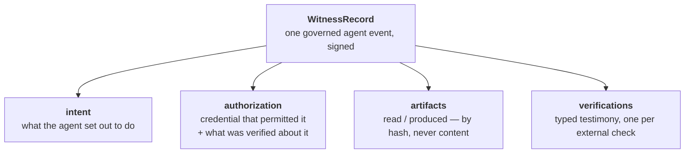
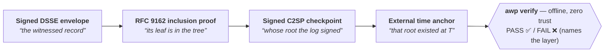
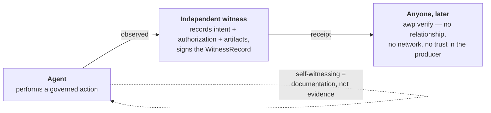

# Agent Witness Protocol (AWP)

**Tamper-evident, offline-verifiable receipts for what AI agents do — verify one without trusting, or even asking, whoever produced it.**

[](./LICENSE)
[](#quick-start)
[](#why-awp-exists-the-honest-8020)
[](https://buymeacoffee.com/aiagentsprp)

> **Status:** v0.1 (early) — **source is public (Apache-2.0)**; not yet on npm. This package ships the **open** parts of AWP:
> the `WitnessRecord` schema and validators, the **DSSE + in-toto** signed envelope, the
> **RFC 9162** transparency-log layer (Merkle inclusion proofs + C2SP checkpoints) with a
> reference append-only log store, external **time anchors** (OpenTimestamps + an RFC 3161
> qualified-TSA slot), the producer operations that assemble a self-contained **receipt
> bundle**, and the offline **`awp verify`** CLI + library that checks that bundle end-to-end.

---

## What this is

A **`WitnessRecord`** is one structured, signed record of a *governed agent event*:

- **intent** — what the agent set out to do;
- **authorization** — the credential that permitted it, *and what was verified about that credential*;
- **artifacts** — what it read or produced, by **hash, never content**;
- **verifications** — the witness's own **typed testimony** about each external thing it checked.



This package is the **schema and the verifier** — the contract every producer emits and every
verifier reads. It is deliberately permissive (Apache-2.0) so **anyone** can read the schema,
validate a record, and re-check a receipt **without a relationship with, and without asking,
whoever produced it.**

---

## Why AWP exists — the honest 80/20

AWP is **not novel cryptography, and it never claimed to be.** It is a careful *composition* of
mature, off-the-shelf standards. Roughly **80% of AWP is commodity** — the interesting part is the
**20% nobody else owns.**

### "Why not just use something that already exists?"

Because the pieces that exist solve an *adjacent* problem (software **supply-chain provenance** —
"who built this binary"), not this one: **a typed, independently-verifiable receipt of a
*runtime agent action* — who authorized it, what was actually verified, with a closed honesty
boundary.** AWP **adopts** the proven substrate and spends its effort only where nothing suitable exists:

| Layer | AWP uses | Already-existing standard | AWP's stance |
|-------|----------|---------------------------|--------------|
| Signed envelope | DSSE + in-toto Statement | in-toto (CNCF graduated) | **adopt** |
| Transparency log | RFC 9162 raw-byte Merkle | RFC 9162 / Certificate Transparency | **adopt** |
| Checkpoints | C2SP `tlog-checkpoint` | C2SP | **adopt** |
| Time anchor | OpenTimestamps / RFC 3161 | OTS / eIDAS | **adopt** |
| Primitives | Ed25519, SHA-256 | — | **adopt — no new crypto** |
| Full-stack transparency | — | IETF **SCITT** | **align, not conform** |

> We don't hide this. The spec's Appendix A is literally titled *"Composition, not invention."*
> Selling AWP as "new cryptography" would be dishonest — and dishonesty is the one thing a
> *witness* cannot afford.

### The 20% that is genuinely ours

1. **Neutral third-party witness topology.** Most tools in this space are *self-hosted
   self-attestation* — which, as one competitor's own author admits, is "documentation, not
   evidence." **You cannot witness your own actions and call it independent.** A truly neutral,
   non-colluding witness is the differentiator.
2. **A typed honesty boundary.** Every verification's `claim_class` is one of
   `integrity-since-witness`, `verified-against`, or `asserted-by` — a *closed enum*. There is no
   representable value that claims more than a witness can support. We found this in **no** competitor.
3. **Verified-human-authorizes-agent-action**, bound into the record (principal binding).
4. **An eIDAS-qualified time path** for regulated-grade timestamping.

None of these live in the envelope bytes — they survive any future format change. **The moat is
the neutral position and the witness semantics, never the wire format.**

---

## What it proves — and what it does *not*

AWP records are **tamper-evident**: a verifier can detect whether a record was altered after it was
witnessed. AWP proves **integrity-since-witness only**. It explicitly does **not** prove:

- **Authenticity-at-origin.** That an artifact is unaltered since witnessing says *nothing* about
  whether it was legitimate when first seen.
- **Identity.** AWP can record that a credential was verified against an issuer's keys. It never
  asserts a person is real or "who they really are." Issuer assurance levels are *echoed*
  (`assurance_echo`), never asserted by AWP.
- **Completeness.** A record proves what *was* recorded — never that everything was recorded.

**This boundary is a feature, not a limitation** — enforced in the *types and the verifier output*,
not just prose. An overclaim (e.g. `verified-against` with a non-`pass` result) **fails
verification**, and every report prints the boundary line verbatim.

---

## How it works — the receipt chain

A **full receipt** is one self-contained file that chains four links. `awp verify` walks the chain
**offline** and reports `PASS`, or `FAIL` naming the exact layer that broke:



`awp verify` runs, and prints by name, every applicable check: `signature`, `statement`, `schema`,
`profile`, `claim-class`, `chain-link`, `checkpoint`, `inclusion`, and `anchor`. Time anchors are
reported as an **honest time bound** ("this record existed no later than T") with the anchor's
**evidentiary weight** — trust-minimized Bitcoin time for OpenTimestamps, and qualified eIDAS
weight for RFC 3161 *only* when the pinned trust anchor is declared qualified, never inferred.

### Why a *neutral* witness



---

## Quick start

```sh
# From a clone (works today):
npm install
npm run build

# Once published to npm, it will be installable directly:
#   npm install agent-witness-protocol
```

### Validate a record (library)

```ts
import { validateWitnessRecord, validateProfile } from 'agent-witness-protocol';

const result = validateWitnessRecord(input);
if (!result.ok) {
  console.error(result.errors);
} else {
  const profile = validateProfile(result.record);
  if (!profile.ok) console.error(profile.failures);
}
```

A JSON Schema (draft 2020-12) equivalent ships at `src/schema/witness-record.schema.json` for
non-TypeScript consumers.

### Verify a receipt — offline, no relationship with the producer

```ts
import { verify } from 'agent-witness-protocol';

const report = verify(receiptJson, { publicKey });
if (!report.ok) {
  for (const c of report.checks) if (!c.ok) console.error(c.name, c.reason);
}
```

### The 10-minute walkthrough (PASS → one-byte flip → FAIL)

A committed full-receipt sample makes the re-performance demo copy-paste — every layer PASS, then a
single flipped hex char that FAILs the exact tampered layer, all offline:

```sh
npm run build

# 1. A full receipt verifies — every layer PASS, exit 0:
node bin/awp.js verify samples/receipt.json

# 2. A copy with ONE flipped hex char in the inclusion proof's tree path —
#    FAIL, exit 1, naming the "inclusion" check. Every OTHER layer still PASSES,
#    so the failure is provably isolated to the tampered layer:
node bin/awp.js verify test/verify/fixtures/full-receipt-tampered.json
```

The sample embeds its own public key, so a single argument is enough. Pass `--pubkey <pem|base64|path>`
to supply a key explicitly, `--prev <hash>` to check a chain link, `--tsa-pubkey <…> --tsa-qualified`
to verify an RFC 3161 anchor against a pinned TSA key, or `--json` for a machine report.

**See also:** [`docs/receipts.md`](docs/receipts.md) (bundle structure + the exact, re-implementable
leaf rule), [`docs/anchoring.md`](docs/anchoring.md) (time anchors), and
[`docs/spec/AWP-v0.1.md`](docs/spec/AWP-v0.1.md) (the full specification).

---

## Profiles

A record carries a `profile` that selects which blocks are required:

| Profile | Requires |
|---|---|
| `pay` | an `authorization` with a mandate-class credential **and** at least one verification on it |
| `doc` | at least one `artifact`; authorization optional (unattended generation is witnessable — it just proves less) |
| `principal` | an `authorization` whose credential is bound to *this* intent (`challenge_binding` or `presentation_binding`) |
| `composite` | intent + at least one artifact + mandate-class authorization + at least one verification (union of `pay` and `doc`) |

---

## Open core — and how the paid part relates

AWP is deliberately split so the open piece is genuinely useful on its own:

- **Open (this repo, Apache-2.0):** the `WitnessRecord` schema + the `awp verify` reference
  verifier + SDK. Read it, fork it, verify anyone's receipts with it.
- **Paid (separate, proprietary):** a production engine and an **operated neutral witness service**
  that issues receipts at scale — multi-tenant, metered, with hosted assurance.

**Why giving the verifier away helps rather than cannibalizes:** AWP is the tool customers use to
**independently check hosted receipts offline**. The more `awp verify` spreads, the more
"AWP-verifiable receipt" becomes a recognized artifact — and a neutral hosted witness is its natural
supplier. The verifier *enables* the service; it doesn't compete with it.

---

## Roadmap

- [x] `WitnessRecord` schema + profile validators
- [x] DSSE + in-toto signed envelope
- [x] RFC 9162 transparency log (inclusion proofs + C2SP checkpoints)
- [x] Time anchors: OpenTimestamps (verify + submit/upgrade) + RFC 3161 qualified-TSA verify slot
- [x] Offline `awp verify` CLI + library (368/368 tests, 0 skipped)
- [x] **Open-sourced** — public on GitHub under Apache-2.0
- [ ] First `npm publish` (finalize the `awp.dev` on-wire namespace first)
- [ ] Adversarial hardening of the principal-binding model
- [ ] Optional SCITT export adapter (only if a customer requires it)

---

## Support

AWP is built and maintained in the open. If it saves you a headache — or you just want to see the
neutral-witness idea grow — **you can buy me a coffee.** It genuinely helps keep this maintained.

[](https://buymeacoffee.com/aiagentsprp)

☕ **https://buymeacoffee.com/aiagentsprp**

---

## License

Code: **Apache-2.0** — see [LICENSE](./LICENSE). Specification document: **CC-BY-4.0**
(authorship: Renata Baldissara-Kunnela).

> AWP verify proves **integrity-since-witness only** — not completeness, not authenticity-at-origin,
> not the identity of any person.
