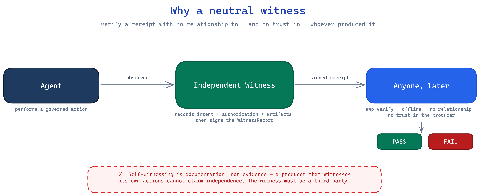
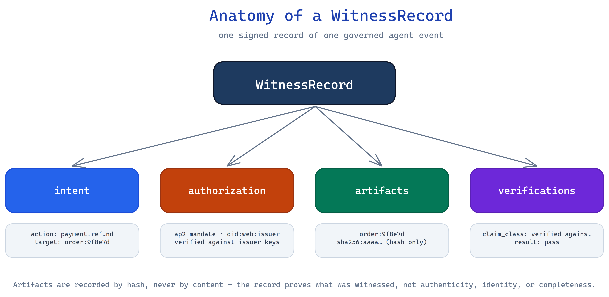

# Agent Witness Protocol (AWP)

### Your agents already act. Most of them leave **no independent evidence**.

**Tamper-evident, offline-verifiable receipts for what AI agents do —  
verify one without trusting, or even *asking*, whoever produced it.**

[](./LICENSE)
[](#prove-it-in-60-seconds)
[](#the-honest-8020)
[](#how-a-receipt-actually-works)
[](https://www.youtube.com/@FriendlyAI_fi)
[](https://buymeacoffee.com/aiagentsprp)

> **Status:** **v0.2.0** · Apache-2.0 · public repo  
> **Wire namespace:** `https://awp.paybotfin.com/witness-record/v1` (production `.com` host — **no `.dev`**, so enterprise filters that block `.dev` still work)  
> Ships: `WitnessRecord` schema, DSSE + in-toto envelope, RFC 9162 log, time anchors, offline `awp verify` CLI + library.  
> npm: not published yet — install from this repo until first `npm publish`.

---

## Watch first (7 languages)

Full explainers on **[@FriendlyAI_fi](https://www.youtube.com/@FriendlyAI_fi)** — pick your language:

| Language | Video |
|----------|--------|
| **English** | [AWP — Agent Witness Protocol](https://www.youtube.com/watch?v=wzfkXXsyvM8) |
| **Suomi** | [Agent Witness Protocol (AWP) Suomeksi](https://www.youtube.com/watch?v=kx9qwmpT8Oo) |
| **Português** | [AWP em Português explicado](https://www.youtube.com/watch?v=Y3QoJZ7vfw8) |
| **Deutsch** | [Was ein KI-Agent tatsächlich getan hat](https://www.youtube.com/watch?v=POPD2NnXHOE) |
| **Français** | [Preuves vérifiables pour agents d'IA](https://www.youtube.com/watch?v=hLClWBNlpIM) |
| **Italiano** | [Dimostrare ciò che un agente IA ha fatto](https://www.youtube.com/watch?v=L5EQY424lLc) |
| **العربية** | [بروتوكول AWP: كشف التلاعب](https://www.youtube.com/watch?v=tLF23iGZXe8) |

[](https://www.youtube.com/watch?v=wzfkXXsyvM8)

---

## Read this before you scroll past

An agent refunds a payment. Issues a document. Acts on a human's mandate.

Six months later someone asks:

> *What exactly did it do? Who authorized it? Can you prove the record was not edited after the fact?*

If the only answer lives **inside the system that produced the action**, you are not holding evidence.  
You are holding a diary the defendant wrote about themselves.

That is the default state of almost every agent stack shipping right now.

**AWP exists so the answer is a file** — a receipt anyone can re-check offline, with no network call and no relationship to the producer.

---

## What you miss if you skip this

| Without AWP | With AWP |
|---|---|
| Logs live where the agent lives — trust the operator | Receipt is **portable** — trust the math |
| "We did not change it" is a verbal claim | **One flipped byte → named FAIL** |
| Self-attestation dressed up as audit | **Neutral witness topology** — you cannot witness yourself |
| Overclaims hide in prose ("verified", "immutable") | Overclaim is **unrepresentable** in the types |
| "When did this exist?" answered by the producer's clock | External time anchor (OpenTimestamps / RFC 3161 path) |
| Supply-chain tools answer *who built the binary* | AWP answers *who authorized the **runtime agent action*** |

| Stakeholder | They eventually ask | Cost of "we only have our logs" |
|---|---|---|
| **Enterprise buyer** | Can our auditor verify independently? | Deal stalls. Rebuild under deadline. |
| **Security / GRC** | Prove integrity without the vendor console | Findings. Board questions. |
| **Legal** | What was authorized, by whom, for which intent? | Weak evidence when it matters. |
| **You in 12 months** | Did this agent do what we think? | Forensic guesswork. |
| **Regulators (direction of travel)** | Tamper-evident logging (e.g. EU AI Act Art. 12 style) | Ad-hoc logs map poorly — AWP is architecture, **not** a compliance certificate |

**Real FOMO (no fake timers):**

1. Agents are already in production — un-witnessed actions never get a receipt later.  
2. Self-attestation is sold as "evidence"; buyers will learn the difference.  
3. Category formation is now — early teams set the receipt grammar.  
4. When the producer is offline or gone, unexportable logs die with them.

---

## Visual overview


*Left: honesty boundary (what a witness may claim). Right: four-layer verification chain.*



*You cannot witness your own actions and call it independent.*

---

## What AWP is

A **`WitnessRecord`** is one structured, signed record of a governed agent event:

| Block | Captures |
|---|---|
| **intent** | What the agent set out to do (action, target, params by hash, policy) |
| **authorization** | Credential that permitted it — and what was verified about it |
| **artifacts** | What it read/produced — **hash, never content** |
| **verifications** | Witness's typed testimony (`claim_class` is a closed enum) |



This package is the **open contract + reference verifier** (Apache-2.0): schema, DSSE envelope, transparency log, time anchors, and offline `awp verify`.

---

## Prove it in 60 seconds

```sh
git clone https://github.com/RBKunnela/awp.git
cd awp
npm install
npm run build

# Clean full receipt → every layer PASS
node bin/awp.js verify samples/receipt.json

# ONE flipped hex char → FAIL, names the layer
node bin/awp.js verify test/verify/fixtures/full-receipt-tampered.json
```

```text
RESULT: PASS   # clean sample — signature, inclusion, anchor, …
RESULT: FAIL   # tampered — failed checks: inclusion
```

**Tamper becomes evident. The broken layer is named.**

### Library

```ts
import { verify } from 'agent-witness-protocol';

const report = verify(receiptJson, { publicKey });
if (!report.ok) {
  for (const c of report.checks) if (!c.ok) console.error(c.name, c.reason);
}
```

```ts
import { validateWitnessRecord, validateProfile } from 'agent-witness-protocol';

const result = validateWitnessRecord(input);
if (result.ok) console.log(validateProfile(result.record));
```

> After npm publish: `npm install agent-witness-protocol`. Today: install from this repo.

---

## How a receipt works

```text
signed DSSE envelope  →  RFC 9162 inclusion  →  signed C2SP checkpoint  →  external time anchor
"the witnessed record"   "leaf is in the tree"   "log signed this root"     "root existed by T"
                              ↓
              awp verify (offline, zero trust) → PASS / FAIL (names failing layer)
```

| Check | On PASS |
|---|---|
| `signature` / `statement` | Envelope intact; subject binds intent |
| `schema` / `profile` | Shape + profile constraints hold |
| `claim-class` | No honesty-boundary overclaim |
| `checkpoint` | Log signed note verifies |
| `inclusion` | Merkle path recomputes same root |
| `anchor` | External time commits that root |

**Two keys on purpose:** envelope key ≠ log key. Full wire shape: [docs/receipts.md](docs/receipts.md).

---

## Honesty boundary (the moat)

AWP proves **integrity-since-witness only**.

| People want this claim | AWP answer |
|---|---|
| Authenticity-at-origin | **No** |
| Identity of a person | **No** (issuer assurance may be *echoed* only) |
| Completeness | **No** |
| "Tamper-proof / uncorruptible" | **No** — only tamper-**evident** |
| Court admissibility | **No** — evidence for forums to judge |

| `claim_class` | Means |
|---|---|
| `integrity-since-witness` | Unaltered since witnessed |
| `verified-against` | Checked against named issuer keys (truth → issuer) |
| `asserted-by` | Honest "we were told" |

Overclaim fails verification. Every report reprints the boundary line.

---

## The honest 80/20

AWP is **not novel cryptography**. ~80% is commodity composition. The **20%** is why it matters.

| Layer | AWP uses | Stance |
|---|---|---|
| Signed envelope | DSSE + in-toto | **adopt** |
| Transparency log | RFC 9162 | **adopt** |
| Checkpoints | C2SP `tlog-checkpoint` | **adopt** |
| Time anchor | OpenTimestamps / RFC 3161 | **adopt** |
| Primitives | Ed25519, SHA-256 | **adopt — no new crypto** |
| Full-stack | IETF SCITT | **align, not conform** |

### The defensible 20%

1. **Neutral third-party witness topology** — self-attestation is not independence  
2. **Typed honesty boundary** — closed enum; overclaim fails closed  
3. **Principal binding** — verified human authorizes *this* agent action  
4. **eIDAS-qualified time path** when pinned as qualified  

**Moat = neutral position + witness semantics — never the wire format.**

---

## Profiles

| Profile | Requires |
|---|---|
| `pay` | Mandate-class authorization + ≥1 verification |
| `doc` | ≥1 artifact |
| `principal` | Auth bound to *this* intent |
| `composite` | Union of pay + doc |

---

## Produce a receipt (implementers)

| Module | Role |
|---|---|
| `schema` | Validate `WitnessRecord` + profiles |
| `envelope` | in-toto Statement → DSSE sign |
| `log` | RFC 9162 store, inclusion, C2SP checkpoints |
| `anchor` | OpenTimestamps + RFC 3161 verify |
| `ops` | Assemble full receipt (`checkpoint` + `proof`) |
| `verify` / CLI | Offline re-performance for anyone |

| Key | Signs | Holder |
|---|---|---|
| Envelope key | Witnessed record | Producer / customer deployment |
| Log key | Checkpoint over Merkle root | (Ideally neutral) log operator |

---

## Open core

| Open (this repo · Apache-2.0) | Paid (separate) |
|---|---|
| Schema + validators + SDK | Production issuer engine |
| Offline `awp verify` | Operated **neutral witness** at scale |

Giving the verifier away is how "AWP-verifiable receipt" becomes a recognized artifact.

---

## Two futures

**Without independent receipts:** disputes hit console screenshots and internal logs. Rebuild starts while production keeps writing unrecoverable history.

**With AWP:** every governed action can emit a portable receipt. Buyers run `awp verify` offline. Tamper names a layer. Time is externally bounded.

---

## Roadmap

- [x] Schema + profile validators  
- [x] DSSE + in-toto envelope  
- [x] RFC 9162 log + C2SP checkpoints  
- [x] OpenTimestamps + RFC 3161 verify slot  
- [x] Offline `awp verify` (368/368 tests)  
- [x] Public GitHub (Apache-2.0)  
- [x] Multilingual YouTube explainers ([@FriendlyAI_fi](https://www.youtube.com/@FriendlyAI_fi))  
- [x] Wire namespace `awp.paybotfin.com` (no `.dev`) + CI + SECURITY/NOTICE + CHANGELOG  
- [ ] First `npm publish` (`agent-witness-protocol`) — operator GO  
- [ ] Principal-binding adversarial hardening  
- [ ] Optional SCITT export adapter (only if a customer requires it)  

---

## Docs

| Resource | Link |
|---|---|
| Cryptographic Architecture (PDF) | [docs/awp-cryptographic-architecture-statement.pdf](docs/awp-cryptographic-architecture-statement.pdf) |
| Full specification | [docs/spec/AWP-v0.1.md](docs/spec/AWP-v0.1.md) |
| Receipt structure | [docs/receipts.md](docs/receipts.md) |
| Time anchoring | [docs/anchoring.md](docs/anchoring.md) |
| Strategic case | [docs/THE-CASE-FOR-AWP.md](docs/THE-CASE-FOR-AWP.md) |
| Security policy | [SECURITY.md](SECURITY.md) |
| Changelog | [CHANGELOG.md](CHANGELOG.md) |
| YouTube channel | [youtube.com/@FriendlyAI_fi](https://www.youtube.com/@FriendlyAI_fi) |

---

## Support

[](https://buymeacoffee.com/aiagentsprp)

https://buymeacoffee.com/aiagentsprp

---

## License

- **Code:** [Apache-2.0](./LICENSE)  
- **Specification:** CC-BY-4.0 (author: Renata Baldissara-Kunnela)  
- **Copyright:** FriendlyAI Oy — see [NOTICE](./NOTICE)

The `awp.paybotfin.com` namespace (when present on the wire) is a **format identifier**, not an endorsement of any particular producer or receipt.

---

### Bottom line

> **AWP verify proves integrity-since-witness only** — not completeness, not authenticity-at-origin, not the identity of any person.

That sentence is why serious people trust the rest.

Your agents are already writing history.  
**Either that history is independently re-checkable — or it is just a story you tell about yourself.**

Clone it. Flip one byte. Watch the layer fail. Then decide if you want to keep shipping agents without receipts.
