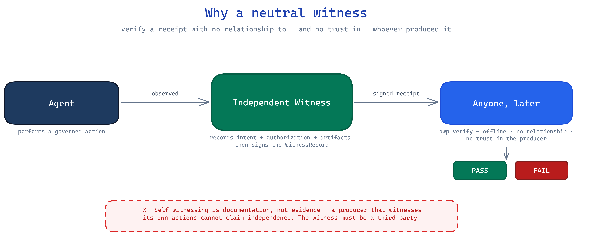
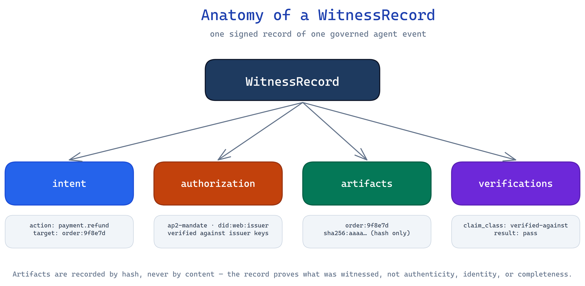

# Agent Witness Protocol (AWP)

### Offline-verifiable receipts for what AI agents do.

[](https://www.npmjs.com/package/agent-witness-protocol)
[](./LICENSE)
[](#prove-it-works-60-seconds)
[](https://www.youtube.com/@FriendlyAI_fi)

> **npm:** [`agent-witness-protocol@0.2.0`](https://www.npmjs.com/package/agent-witness-protocol) ·  
> **Wire type:** [`https://awp.paybotfin.com/witness-record/v1`](https://awp.paybotfin.com/witness-record/v1) ·  
> **Schema:** [`…/schema.json`](https://awp.paybotfin.com/witness-record/v1/schema.json)

**Start here (copy/paste):**

```bash
npm install agent-witness-protocol
npx awp verify node_modules/agent-witness-protocol/samples/receipt.json
# → RESULT: PASS
```

---

## User guide (read this first)

This section is the full **how to install, how to use, what AWP does, what it does not do**, and **why you need a receipt file** from an issuer (payment platform, witness service, or other governed system).

### 1) What AWP is

**AWP** is an open protocol + npm package that lets **anyone** re-check a portable **receipt JSON** offline — without logging into the vendor console and without trusting the producer.

It is **not** a payment app by itself. It is the **verify** layer for evidence that some platform already produced.

```text
  Agent / system acts
         │
         ▼
  Issuer (witness service, payment platform, governance hub…)
  creates a receipt file  ──►  receipt.json  (the “body” you keep)
         │
         ▼
  Anyone with this package:
  npx awp verify receipt.json  ──►  PASS or FAIL
```

### 2) Critical: you need a receipt body (the file)

`awp verify` **does not** invent evidence. It only checks a **receipt you already have**.

| You have… | What you do |
|-----------|-------------|
| A `receipt.json` (or export pack containing AWP receipts) from a **witness / platform** | Run `npx awp verify path/to/receipt.json` |
| Only a payment success screen / bank API / chat log | That is **not** an AWP receipt — install does nothing until an issuer produces one |
| Nothing yet | Use the **sample** shipped in the package to learn the tool (below), then get real receipts from your platform |

**Who issues the receipt body?**

| Issuer | Role |
|--------|------|
| **PayBotFin witness** (hosted / private product) | Neutral multi-tenant **issuer** of AWP receipts at scale |
| **PayBot / paybot-core** (payments + governance) | May authorize/pay; production path attaches witness receipts (wiring matures over time) |
| **Any partner platform** that implements AWP | Can issue valid receipts if they follow the schema + crypto layers |
| **This open package alone** | Lets you **verify** (and build test receipts in ops/tests) — it is **not** your production “install and magically witness the world” installer |

**Rule of thumb:**  
- **Install AWP** = you can **verify**.  
- **PayBot / witness / platform** = someone **issues** the receipt you verify.  
- Payment success ≠ AWP PASS (two different checks until your platform wires them).

See packaging lock: [AWP open / PayBot private (Chefe 1057)](docs/decisions/2026-07-31-ADR-AWP-OSS-PAYBOT-PRIVATE-1057.md).

### 3) What AWP **does** (when you have a receipt)

`npx awp verify receipt.json` runs a fail-closed chain of checks, including:

| Check (examples) | Meaning |
|------------------|---------|
| envelope + signature | DSSE envelope well-formed; Ed25519 signature holds |
| statement | in-toto Statement binds intent |
| schema / profile | WitnessRecord shape + profile constraints (`pay`, `doc`, …) |
| claim-class | Honesty boundary enforced in types |
| checkpoint + inclusion | Receipt is in a signed transparency log (RFC 9162) |
| anchor | Time bound when present (e.g. OpenTimestamps / TSA) |

If someone flips one byte of a sealed receipt → **RESULT: FAIL**.

### 4) What AWP **does not** do (honesty boundary)

Printed on every successful verify report as well:

| Proves | Does **not** prove |
|--------|---------------------|
| Receipt is consistent and correctly signed | Authenticity of the original real-world act |
| Unaltered since it was witnessed | Identity of a human |
| Inclusion in a signed log + time bound (when present) | Completeness (“every action was recorded”) |
| Integrity-**since-witness** | That the vendor console is honest without a receipt file |

Also **not** this package’s job:

- Replacing a bank, card network, or wallet  
- Scanning “any ledger on the internet” without a receipt file  
- Automatically turning every PayBot payment into a receipt (platform must issue/attach — see roadmap)  
- Claiming “we replaced SIEM” by itself — AWP is the **receipt verify** layer of a larger stack  

That boundary is a **feature** (liability firewall), not a bug.

### 5) How to install (all options)

Requires **Node.js** (npm or npx). Package is **ESM-only** — for library imports set `"type": "module"` in `package.json` or use `.mjs`.

#### Option A — one-shot with npx (no project install)

```bash
npx --yes --package=agent-witness-protocol@0.2.0 awp verify ./my-receipt.json
```

Use this when you only want to verify a file you already received.

#### Option B — install into a project (recommended for builders)

```bash
npm install agent-witness-protocol

# CLI (uses local bin)
npx awp verify ./my-receipt.json

# Sample shipped in the package (always works offline)
npx awp verify node_modules/agent-witness-protocol/samples/receipt.json
# → RESULT: PASS
```

#### Option C — global CLI (optional)

```bash
npm install -g agent-witness-protocol
awp verify ./my-receipt.json
```

#### Option D — from source (maintainers / contributors)

```bash
git clone https://github.com/RBKunnela/awp.git
cd awp && npm install && npm run build
node bin/awp.js verify samples/receipt.json
```

| Surface after install | How |
|-----------------------|-----|
| CLI | `npx awp verify <file.json>` |
| Library | `import { verify, validateWitnessRecord } from 'agent-witness-protocol'` |
| Subpaths | `agent-witness-protocol/schema`, `/verify`, `/envelope`, `/anchor`, `/log` |
| Schema (non-TS) | package schema file or [live schema](https://awp.paybotfin.com/witness-record/v1/schema.json) |

### 6) How to use it (day-to-day)

#### Auditor / customer (most common)

1. Get the **receipt file** from the platform (download, email attachment, export pack, API).  
2. Keep that file (it is the evidence, not a screenshot).  
3. On any machine with Node:

```bash
npx awp verify ./receipts/action-2026-07-21.json
```

4. Read the report: **RESULT: PASS** or **FAIL** + named failed checks.  
5. Share the **file** with counsel/auditors so they can re-run the same command.

#### Agent builder

1. After a governed action, **save** the receipt JSON your platform/witness returns.  
2. Do **not** re-implement Merkle/DSSE — import this package or call the CLI.  
3. Optionally assert `verify(...).ok` in CI before shipping a report to a client.

#### Platform operator (PayBotFin / partner)

1. **Issue** receipts with a witness service that **imports** `agent-witness-protocol` (never reimplements crypto).  
2. Hand the file to the customer.  
3. They verify offline with this same public package.

#### Integrator (library)

```ts
import { verify, validateWitnessRecord } from 'agent-witness-protocol';
import { readFileSync } from 'node:fs';

const receipt = JSON.parse(readFileSync('./receipts/action.json', 'utf8'));

// Shape only
const shape = validateWitnessRecord(receipt);
if (!shape.ok) throw new Error(JSON.stringify(shape.errors));

// Full verify (library needs publicKey; CLI can read public_key_pem from the file)
const report = verify(receipt, { publicKey: receipt.public_key_pem });
if (!report.ok) {
  for (const c of report.checks) if (!c.ok) console.error(c.name, c.reason);
  process.exit(1);
}
console.log('PASS — integrity-since-witness');
```

CLI flags: `--pubkey`, `--prev`, `--tsa-pubkey`, `--tsa-qualified`, `--json`.

### 7) Roles at a glance

| You are… | You use AWP to… | You still need… |
|----------|-----------------|-----------------|
| **Auditor / customer** | Verify a receipt offline | The receipt file from the issuer |
| **Agent builder** | Keep + re-check evidence | Platform that issues receipts |
| **Platform (e.g. PayBotFin)** | Issue via witness that imports this package | Hosted/private witness engine (not this OSS alone) |
| **Integrator** | Validate schema + call `verify()` | Receipt bundles from production |

### 8) What a receipt is (the file body)

One JSON bundle chaining four layers:

```text
DSSE + in-toto envelope  →  RFC 9162 inclusion  →  C2SP checkpoint  →  time anchor (OTS / RFC 3161)
```

Named CLI checks (fail-closed):  
`envelope-shape`, `payloadType`, `signature`, `statement`, `schema`, `profile`, `claim-class`, `chain-link`, `checkpoint`, `inclusion`, `anchor`.

### 9) Not only payments — multi-profile (pay · doc · principal · composite)

AWP started next to **PayBot payments**, but the **protocol is not pay-only**.  
One schema; four **profiles** (constraint sets). The `intent.action` verb can be any governed action (`payment.refund`, `doc.generate`, `order.place`, …).

| Profile | When to use | Minimum (extra beyond core fields) |
|---------|-------------|-------------------------------------|
| **pay** | Agent moved money under a payment mandate | Mandate-class `authorization` + ≥1 `verification` |
| **doc** | Agent produced or read a document | ≥1 `artifact` (authorization optional) |
| **principal** | A verified human stands behind *this* action | Credential **bound to this intent** (not just a session) |
| **composite** | E-commerce scene (pay + doc + human) | Union of pay + doc minimums |

**Full crypto receipts** (offline `awp verify` → PASS for every profile) — Chefe **1072**:

| File | Profile | Command |
|------|---------|---------|
| [`samples/receipts/pay.json`](samples/receipts/pay.json) | pay | `npx awp verify samples/receipts/pay.json` |
| [`samples/receipts/doc.json`](samples/receipts/doc.json) | doc | `npx awp verify samples/receipts/doc.json` |
| [`samples/receipts/principal.json`](samples/receipts/principal.json) | principal | `npx awp verify samples/receipts/principal.json` |
| [`samples/receipts/composite.json`](samples/receipts/composite.json) | composite | `npx awp verify samples/receipts/composite.json` |
| [`samples/receipt.json`](samples/receipt.json) | pay (walkthrough alias) | `npx awp verify samples/receipt.json` |

Generator: `npm run gen:multi-profile-receipts` · Hosted multi-profile POST: paybotfin-witness (tenant `allowed_profiles`).

**Shape/profile samples** (predicates only — library `validateProfile`, not full crypto) also ship:

| File | Profile |
|------|---------|
| [`samples/profiles/pay.json`](samples/profiles/pay.json) | pay |
| [`samples/profiles/doc.json`](samples/profiles/doc.json) | doc |
| [`samples/profiles/principal.json`](samples/profiles/principal.json) | principal |
| [`samples/profiles/composite.json`](samples/profiles/composite.json) | composite |
| Guide | [`samples/profiles/README.md`](samples/profiles/README.md) |

```bash
npm install agent-witness-protocol
node --input-type=module <<'EOF'
import { readFileSync } from 'node:fs';
import { validateWitnessRecord, validateProfile } from 'agent-witness-protocol';

for (const name of ['pay', 'doc', 'principal', 'composite']) {
  const rec = JSON.parse(
    readFileSync(`node_modules/agent-witness-protocol/samples/profiles/${name}.json`, 'utf8')
  );
  const shape = validateWitnessRecord(rec);
  const prof = shape.ok ? validateProfile(shape.record) : shape;
  console.log(name, shape.ok && prof.ok ? 'OK' : prof);
}
EOF
```

| Goal | Use |
|------|-----|
| Full crypto offline verify (all profiles) | `npx awp verify samples/receipts/<profile>.json` |
| Learn non-pay shapes (predicate only) | `samples/profiles/*.json` + `validateProfile` as above |
| Hosted issuance multi-profile | paybotfin-witness: set tenant `allowed_profiles` to include `doc`/`principal`/`composite`; POST full records |

No protocol redesign required. **Gap closed (1072):** full verify samples for all 4 profiles + witness allow-list honors `record.profile`. Remaining: paybot-core auto-emit of full WitnessRecords for every event class (see mapping doc).

---

## What problem this solves

An agent paid someone, refunded an order, or wrote a document. Later someone asks:

> *What did it do, who authorized it, and was the log altered?*

If the only answer is the vendor’s console, that is a diary — not independent evidence.

**AWP** defines a **portable receipt file** anyone can re-check **offline**, without trusting the producer.

```text
Agent acts  →  (optional) PayBot governs / pays  →  witness issues AWP receipt
                                                    ↓
                              anyone:  npx awp verify receipt.json  →  PASS / FAIL
```

---

## Prove it works (60 seconds)

```bash
npm install agent-witness-protocol

# 1) Clean sample shipped in the package (no issuer account needed)
npx awp verify node_modules/agent-witness-protocol/samples/receipt.json
# RESULT: PASS  (signature, schema, inclusion, checkpoint, anchor, …)

# 2) Library
node --input-type=module <<'EOF'
import { verify, PREDICATE_TYPE } from 'agent-witness-protocol';
import { readFileSync } from 'node:fs';
const receipt = JSON.parse(
  readFileSync('node_modules/agent-witness-protocol/samples/receipt.json', 'utf8')
);
const report = verify(receipt, { publicKey: receipt.public_key_pem });
console.log(PREDICATE_TYPE);
console.log(report.ok ? 'PASS' : 'FAIL', report.checks.filter(c => !c.ok).map(c => c.name));
EOF
```

**One-shot without a project folder:**

```bash
npx --yes --package=agent-witness-protocol@0.2.0 awp verify ./my-receipt.json
```

**Tamper isolation (from a clone of this repo):** flip one hex char in the inclusion path → `FAIL` names `inclusion`; other layers can still PASS.

```bash
git clone https://github.com/RBKunnela/awp.git && cd awp && npm i && npm run build
node bin/awp.js verify test/verify/fixtures/full-receipt-tampered.json
# RESULT: FAIL  failed checks: inclusion
```

**Exhaustive smoke (maintainers):**

```bash
npm i agent-witness-protocol   # or use local build
node tools/exhaustive-npm-smoke.mjs
```

---

## Using AWP **with** paybot-sdk and paybot-mcp

These are **three layers** of one stack. Today they connect as follows:

```text
┌─────────────────────────────────────────────────────────────┐
│  AI host (Claude, Cursor, custom agent)                     │
│    └── paybot-mcp   (MCP tools: pay, balance, history, …)   │
└────────────────────────────┬────────────────────────────────┘
                             │ calls
                             ▼
┌─────────────────────────────────────────────────────────────┐
│  paybot-sdk   (PayBotClient.pay / register / x402 handler)  │
└────────────────────────────┬────────────────────────────────┘
                             │ HTTPS + API key
                             ▼
┌─────────────────────────────────────────────────────────────┐
│  paybot-core (facilitator + governance)  [private / hosted] │
│    authorize · policy · optional x402 settle · audit chain  │
└────────────────────────────┬────────────────────────────────┘
                             │ (production path — witness service)
                             ▼
┌─────────────────────────────────────────────────────────────┐
│  paybotfin-witness (issues AWP receipt bundles)             │
│    imports agent-witness-protocol — does NOT reimplement    │
└────────────────────────────┬────────────────────────────────┘
                             │ receipt.json
                             ▼
┌─────────────────────────────────────────────────────────────┐
│  agent-witness-protocol   npx awp verify   (offline, you)   │
└─────────────────────────────────────────────────────────────┘
```

### Install the public trio

```bash
npm install agent-witness-protocol paybot-sdk paybot-mcp
```

| Package | License | Role |
|---------|---------|------|
| [`agent-witness-protocol`](https://www.npmjs.com/package/agent-witness-protocol) | Apache-2.0 | **Verify** (and build) receipts |
| [`paybot-sdk`](https://www.npmjs.com/package/paybot-sdk) | MIT | Bot payments + x402 client |
| [`paybot-mcp`](https://www.npmjs.com/package/paybot-mcp) | Apache-2.0 | MCP tools wrapping the SDK |

### 1) Agent payments via MCP (paybot-mcp)

```json
{
  "mcpServers": {
    "paybot": {
      "command": "npx",
      "args": ["paybot-mcp"],
      "env": {
        "PAYBOT_API_KEY": "pb_...",
        "PAYBOT_FACILITATOR_URL": "https://api.paybotcore.com",
        "PAYBOT_BOT_ID": "my-agent"
      }
    }
  }
}
```

Tools include `paybot_pay`, `paybot_balance`, `paybot_history`, `paybot_register`, limits, pools, etc.  
Omit `PAYBOT_WALLET_KEY` → **mock** settlement (no on-chain funds).

Get a key (once):

```bash
node --input-type=module -e "import { PayBotClient } from 'paybot-sdk'; const a = await PayBotClient.signup('you@example.com', 'strong-password', { botId: 'my-agent' }); console.log(a.apiKey);"
```

### 2) Same flow in code (paybot-sdk)

```ts
import { PayBotClient } from 'paybot-sdk';

const client = new PayBotClient({
  apiKey: process.env.PAYBOT_API_KEY!,
  botId: 'my-agent',
  facilitatorUrl: 'https://api.paybotcore.com',
  // walletPrivateKey: process.env.PAYBOT_WALLET_KEY, // only for real settlement
});

const result = await client.pay({
  resource: 'https://api.example.com/data',
  amount: '0.01',
  payTo: '0x…',
});
// Keep result + any receipt your platform attaches for AWP verify later
```

### 3) Verify evidence offline (this package)

Whenever you hold a **receipt file** from a witness / platform:

```bash
npx awp verify ./receipts/action-2026-07-21.json
```

Or in TypeScript:

```ts
import { verify } from 'agent-witness-protocol';
import { readFileSync } from 'node:fs';

const receipt = JSON.parse(readFileSync('./receipts/action.json', 'utf8'));
// Library: pass the key explicitly (CLI auto-reads public_key_pem from the file)
const report = verify(receipt, { publicKey: receipt.public_key_pem });

if (!report.ok) {
  for (const c of report.checks) if (!c.ok) console.error(c.name, c.reason);
  process.exit(1);
}
console.log('PASS — integrity-since-witness');
```

### Integration reality (honest)

| Capability | Status today |
|------------|----------------|
| Install & verify AWP receipts from npm | **Works** |
| PayBot SDK/MCP payments (mock or live facilitator) | **Works** (public packages) |
| Hosted multi-tenant **witness** issuing receipts in prod | **In progress** (DEV path; uses this package) |
| Automatic “every MCP pay() returns an AWP receipt” | **Not automatic yet** — platform must attach/issue receipt via witness |
| Self-issued demo receipts for tests | Use package `samples/receipt.json` or generate with AWP ops APIs |

So the **user path that works end-to-end today** is:

1. Use **paybot-mcp / paybot-sdk** for agent payments and governance against the facilitator.  
2. Use **agent-witness-protocol** to **verify any receipt you receive** (sample, witness service, or partner).  
3. Treat “payment success” and “AWP PASS” as **two different checks** until your platform wires them together.

---

## Library API (quick)

```ts
import {
  validateWitnessRecord,
  validateProfile,
  verify,
  PREDICATE_TYPE,
} from 'agent-witness-protocol';

// 1) Shape only
const v = validateWitnessRecord(json);
if (!v.ok) throw new Error(JSON.stringify(v.errors));
const p = validateProfile(v.record); // pay | doc | principal | composite

// 2) Full receipt bundle (envelope + log + anchor)
//    Library requires publicKey; CLI can read public_key_pem from the file.
const report = verify(receiptBundle, {
  publicKey: receiptBundle.public_key_pem,
});
```

CLI options: `--pubkey`, `--prev`, `--tsa-pubkey`, `--tsa-qualified`, `--json`.

---

## How the receipt chain works


| Layer | Standard | CLI check |
|-------|----------|-----------|
| Signed record | DSSE + in-toto Statement | `signature`, `statement` |
| Schema / profile / honesty | AWP WitnessRecord | `schema`, `profile`, `claim-class` |
| Log membership | RFC 9162 inclusion | `inclusion` |
| Log head | C2SP checkpoint | `checkpoint` |
| Time | OpenTimestamps / RFC 3161 | `anchor` |



---

## WitnessRecord (what is inside)



| Block | Meaning |
|-------|---------|
| **intent** | Agent, action, target, params **hash**, policy decision |
| **authorization** | Credential that permitted it + what was verified |
| **artifacts** | Inputs/outputs by **hash**, never content |
| **verifications** | Typed testimony (`claim_class` closed enum) |

Profiles: `pay` · `doc` · `principal` · `composite`.

---

## Videos

| Lang | Link |
|------|------|
| EN | https://www.youtube.com/watch?v=wzfkXXsyvM8 |
| FI | https://www.youtube.com/watch?v=kx9qwmpT8Oo |
| PT | https://www.youtube.com/watch?v=Y3QoJZ7vfw8 |
| DE | https://www.youtube.com/watch?v=POPD2NnXHOE |
| FR | https://www.youtube.com/watch?v=hLClWBNlpIM |
| IT | https://www.youtube.com/watch?v=L5EQY424lLc |
| AR | https://www.youtube.com/watch?v=tLF23iGZXe8 |

Channel: [@FriendlyAI_fi](https://www.youtube.com/@FriendlyAI_fi)

---

## Docs in this repo

| Doc | Content |
|-----|---------|
| [spec/AWP-v0.1.md](docs/spec/AWP-v0.1.md) | Normative specification |
| [receipts.md](docs/receipts.md) | Bundle wire format + leaf rule |
| [anchoring.md](docs/anchoring.md) | Time anchors |
| [THE-CASE-FOR-AWP.md](docs/THE-CASE-FOR-AWP.md) | Strategy / 80–20 honesty |
| [Architecture PDF](docs/awp-cryptographic-architecture-statement.pdf) | Plain-language crypto report |

---

## Open core vs hosted witness

| Open (this package) | Hosted (PayBotFin / separate) |
|---------------------|--------------------------------|
| Schema + verify + sample | Multi-tenant issuance at scale |
| Anyone re-checks offline | Metered neutral witness service |

---

## Roadmap

- [x] Schema, envelope, log, anchors, `awp verify`  
- [x] 368/368 tests, CI  
- [x] Live namespace on `awp.paybotfin.com`  
- [x] **npm `agent-witness-protocol@0.2.0`**  
- [ ] Production multi-tenant witness (depends on this package via npm, not `file:`)  
- [ ] Automatic receipt attach from paybot-core authorize/settle  
- [ ] Optional SCITT export adapter (customer-triggered)  

---


## Agent skill: `awp-doctrine` (any LLM)

### What the skill **does**
- Gives **any agent** (Grok, OpenClaw, Claude Code, Copilot, Amp, …) a short doctrine pack so it explains AWP correctly
- States the **honesty boundary** (what PASS proves / does not prove)
- Separates **open npm verify** vs **PayBot private issuer**
- Tells the agent **when** to send people to `npx awp verify`
- **No npm required** to use the skill — it is markdown only

### What the skill **does not** do
- Does **not** run cryptography or produce PASS/FAIL
- Does **not** issue or sign receipts (that is an **issuer**, e.g. PayBotFin witness)
- Does **not** replace installing `agent-witness-protocol` when you need real offline verify
- Does **not** replace this README, the schema, or the code

**Analogy:** the skill is the instruction sheet; the npm package is the machine that stamps/checks the seal.

| Want | Do |
|------|-----|
| Agent knows AWP doctrine | Copy `skills/awp-doctrine/` into your agent skills root — **no npm** |
| Offline verify a receipt | `npm i agent-witness-protocol` then `npx awp verify path/to/receipt.json` |

```bash
cp -a skills/awp-doctrine ~/.claude/skills/awp-doctrine
# or: ~/.agents/skills/awp-doctrine

./skills/awp-doctrine/load-for-any-llm.sh "honesty"
```

Path: [`skills/awp-doctrine/`](./skills/awp-doctrine/)


## Support

[](https://buymeacoffee.com/aiagentsprp)

https://buymeacoffee.com/aiagentsprp

---

## Packaging lock (Chefe 1057)

**AWP open / PayBot private** — see [`docs/decisions/2026-07-31-ADR-AWP-OSS-PAYBOT-PRIVATE-1057.md`](docs/decisions/2026-07-31-ADR-AWP-OSS-PAYBOT-PRIVATE-1057.md).

## License

- **Code:** [Apache-2.0](./LICENSE)  
- **Spec document:** CC-BY-4.0 (Renata Baldissara-Kunnela)  
- **Copyright:** FriendlyAI Oy — [NOTICE](./NOTICE)

The `awp.paybotfin.com` namespace is a **format identifier**, not an endorsement of any emitter.

---

### Bottom line

```bash
# Install verifier (open)
npm install agent-witness-protocol
npx awp verify node_modules/agent-witness-protocol/samples/receipt.json

# Real evidence: need a receipt body from a witness / payment platform, then:
npx awp verify ./my-receipt.json
```

| Layer | Does |
|-------|------|
| **AWP** (this package) | **Verify** offline — anyone, npm/npx |
| **PayBot / witness / platform** | **Issue** the receipt body you verify |
| **paybot-sdk / paybot-mcp** | **Act** (pay, tools) — not a substitute for AWP PASS |

Full user guide: [§ User guide](#user-guide-read-this-first).
